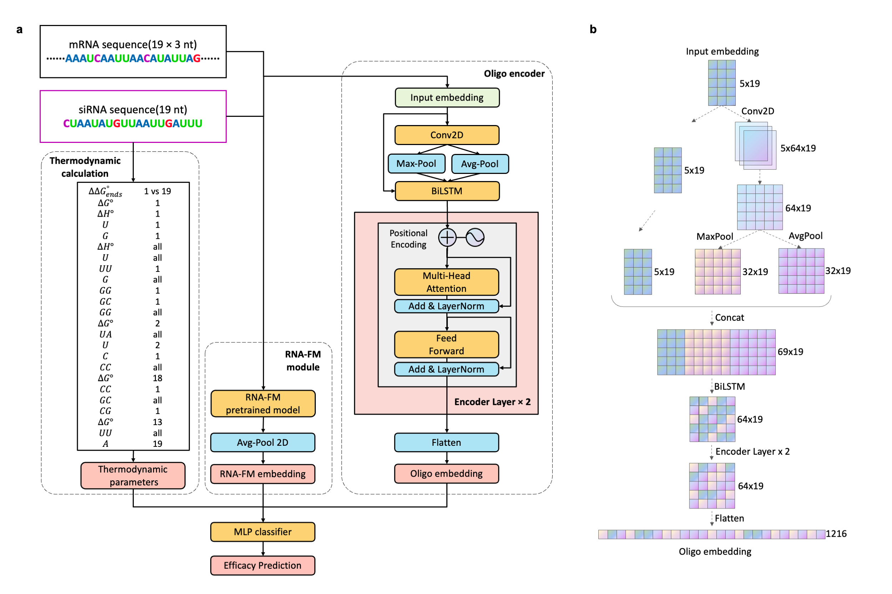

# OligoFormer

[](https://www.python.org/) 

Gene silencing through RNA interference (RNAi) has emerged as a powerful tool for studying gene function and developing therapeutics[1]. Small interfering RNA (siRNA) molecules play a crucial role in RNAi by targeting specific mRNA sequences for degradation. Identifying highly efficient siRNA molecules is essential for successful gene silencing experiments and therapeutic applications. Built on the transformer architecture[2],  OligoFormer can capture multi-dimensional features and learn complex patterns of siRNA-mRNA interactions for siRNA efficacy prediction.

## Datasets

OligoFormer was trained on a dataset of mRNA and siRNA pairs with experimentally measured efficacy by Huesken et al[4]. The training data consisted of diverse mRNA sequences and corresponding siRNA molecules with known efficacies.

| dataset                                                      | siRNA number | cell  line              | 
| ------------------------------------------------------------ | ------------ | ----------------------- | 
| [Huesken](https://www.nature.com/articles/nbt1118)           | 2431         | H1299                   |
| [Reynolds](https://www.nature.com/articles/nbt936)           | 240          | HEK293                  | 
| [Vickers](https://www.jbc.org/article/S0021-9258(19)32641-9/fulltext) | 76           | T24                     | 
| [Haborth](https://www.liebertpub.com/doi/10.1089/108729003321629638) | 44           | HeLa                    |     
| [Ui-](https://academic.oup.com/nar/article/32/3/936/2904484?login=false)[Tei](https://academic.oup.com/nar/article/32/3/936/2904484?login=false) | 62           |             HeLa                           |
| [Khvorova](https://www.nature.com/articles/nbt936)           | 14           | HEK293                  | 
| [Hiesh](https://academic.oup.com/nar/article/32/3/893/2904476) | 108          | HEK293T                 | 
| [Amarzguioui](https://pubmed.ncbi.nlm.nih.gov/12527766/)     | 46           | Cos-1,  HaCaT           |
| [Takayuki](https://academic.oup.com/nar/article/35/4/e27/1079934) | 702          | HeLa                    | 

## Model



## Installation

### OligoFormer environment

Download the repository and create the environment of RNA-FM.

```bash
#Clone the OligoFormer repository from GitHub
git clone https://github.com/lulab/OligoFormer.git
cd ./OligoFormer
#Install the required dependencies
conda env create -n oligoformer -f environment.yml
```

### RNA-FM environment

Download the repository and create the environment of RNA-FM.
```
git clone https://github.com/ml4bio/RNA-FM.git
cd ./RNA-FM
conda env create --name RNA-FM -f environment.yml
```

Download pre-trained models from [this gdrive link](https://drive.google.com/drive/folders/1VGye74GnNXbUMKx6QYYectZrY7G2pQ_J?usp=share_link) and place the pth files into the `pretrained` folder.


## Usage

You should have at least an NVIDIA GPU and a driver on your system to run the training or inference.

### 1.Activate the created conda environment

```source activate oligoformer```

### 2.Model training

```
#The following command take ~30 min on a V100 GPU
python script/main.py --datasets ['Hu','new'] --cuda 0 --learning_rate 0.0001 --batch_size 16 --epoch 100 --early_stopping 30
```

### 3.Model inference
```
python script/main.py --infer 1 --infer_fasta ./data/example.fa --infer_output ./result/
```


- Example output

```text
pos	sense	siRNA	efficacy
0	GGUUCAAUUUAAUUUGCGA	UCGCAAAUUAAAUUGAACC	0.8611790006160736
1	GUUCAAUUUAAUUUGCGAA	UUCGCAAAUUAAAUUGAAC	0.8966651269197464
2	UUCAAUUUAAUUUGCGAAA	UUUCGCAAAUUAAAUUGAA	0.8236525055766105
3	UCAAUUUAAUUUGCGAAAG	CUUUCGCAAAUUAAAUUGA	0.6371348116993903
4	CAAUUUAAUUUGCGAAAGA	UCUUUCGCAAAUUAAAUUG	0.8028793825507163
5	AAUUUAAUUUGCGAAAGAG	CUCUUUCGCAAAUUAAAUU	0.5761866388320923
6	AUUUAAUUUGCGAAAGAGA	UCUCUUUCGCAAAUUAAAU	0.8054059644341469
7	UUUAAUUUGCGAAAGAGAC	GUCUCUUUCGCAAAUUAAA	0.5570545950829983
8	UUAAUUUGCGAAAGAGACC	GGUCUCUUUCGCAAAUUAA	0.48359013041853904
9	UAAUUUGCGAAAGAGACCU	AGGUCUCUUUCGCAAAUUA	0.5515769239962101

# pos: start position of siRNA at mRNA
# sense: sense strand sequence, complimentary to siRNA
# siRNA: siRNA sequence
# efficacy: The predicted efficacy of siRNA
```


## References

[1] [Zamore, Phillip D., et al. "RNAi: double-stranded RNA directs the ATP-dependent cleavage of mRNA at 21 to 23 nucleotide intervals." *cell* 101.1 (2000): 25-33.](https://www.sciencedirect.com/science/article/pii/S0092867400806200)

[2] [Vaswani, Ashish, et al. "Attention is all you need." *Advances in neural information processing systems* 30 (2017).](https://proceedings.neurips.cc/paper/2017/file/3f5ee243547dee91fbd053c1c4a845aa-Paper.pdf)

[3] [Zhao, Weihao, et al. "POSTAR3: an updated platform for exploring post-transcriptional regulation coordinated by RNA-binding proteins." *Nucleic Acids Research* 50.D1 (2022): D287-D294.](https://academic.oup.com/nar/article/50/D1/D287/6353804)

[4] [Huesken, D., Lange, J., Mickanin, C. *et al.* Design of a genome-wide siRNA library using an artificial neural network. *Nat Biotechnol* **23**, 995–1001 (2005).](https://www.nature.com/articles/nbt1118#Abs1)

